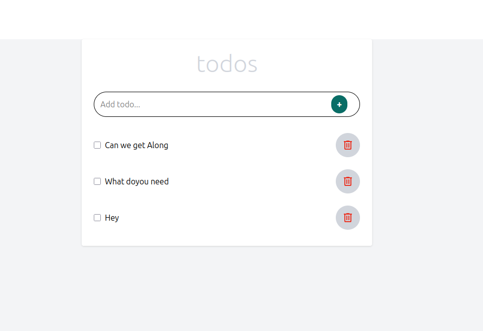

# Todo App

This is a simple and clean **To-Do application** built using `React` with `TypeScript` and styled with `TailwindCSS`. It allows users to:

- Add new tasks  
- Mark tasks as completed  
- Delete tasks  

It serves as a good example for learning **component-based architecture**, **state management**, and **styling** with **TailwindCSS**.

## Features

- Add tasks by typing into the input field and submitting  
- Mark tasks as completed using a checkbox  
- Delete tasks from the list  
- Updates happen in real-time using React state

## Current Limitations

- Data is not saved permanently. When the page is refreshed, all **todos** are lost  
- There is no backend or database to store data  

## Future Improvements

- Add support for task categories or tabs such as: To Do, In Progress, Reviewing, and Done  
- Integrate **localStorage** or connect to a database to persist data  
- Deploy the project to a hosting platform  

## Output

## Live Preview

[You can use this link to preview the like app](https://todoappbycg.netlify.app/)

